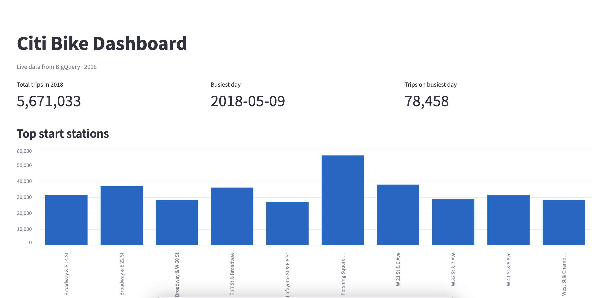

# BigQuery Project

Python project with BigQuery service-account authentication, Citi Bike analytics, a Streamlit dashboard, and GitHub Actions CI/automation.

**Repo:** [github.com/nasrineshraghi/newyork-data-cursor](https://github.com/nasrineshraghi/newyork-data-cursor)

## Project structure

```
.
├── .github/workflows/
│   ├── ci.yml                 # Tests + BigQuery smoke test on push
│   └── citibike_report.yml     # Weekly automated Citi Bike report
├── credentials/               # Local service account key (gitignored)
├── dashboard/
│   └── app.py                 # Streamlit dashboard
├── scripts/
│   ├── test_connection.py     # Connection smoke test
│   ├── query_citibike_daily.py # Daily bikes/trips query
│   └── citibike_explore.py    # Exploration queries + CSV export
├── src/
│   ├── bigquery_client/       # Reusable BigQuery client
│   └── citibike/              # Shared Citi Bike SQL queries
├── tests/                     # Unit tests
├── .env.example
├── requirements.txt
└── requirements-dev.txt
```

## Local setup

### 1. Create a virtual environment

```bash
python3 -m venv .venv
source .venv/bin/activate
pip install -r requirements-dev.txt
```

### 2. Add your service account key

1. In [Google Cloud Console](https://console.cloud.google.com/), create or download a service account JSON key.
2. Save it locally (never commit it):

```bash
mkdir -p credentials
cp /path/to/your-key.json credentials/service-account.json
```

3. Copy the example env file and update values:

```bash
cp .env.example .env
```

Your `.env` should look like:

```env
GCP_PROJECT_ID=your-gcp-project-id
GOOGLE_APPLICATION_CREDENTIALS=credentials/service-account.json
```

### 3. Test the connection

```bash
python scripts/test_connection.py
```

## Citi Bike dashboard

Interactive dashboard powered by **Streamlit** and live BigQuery data from `data_engineering_int.newyork_citibike_trips`.

### Run the dashboard

```bash
source .venv/bin/activate
streamlit run dashboard/app.py
```

Your browser opens at `http://localhost:8501`.

Press **Ctrl + C** in the terminal to stop the dashboard.

### What the dashboard shows

| Section | Description |
|---------|-------------|
| **Metrics** | Total trips in 2018, busiest day, trips on that day |
| **Top start stations** | Bar chart of the 10 busiest stations |
| **Trips by weekday** | Bar chart (Mon–Sun) |
| **Trips by month** | Line chart across 2018 |
| **Raw data** | Expandable table of station results |

### Add a screenshot to the README (optional)

1. With the dashboard open, take a screenshot.
2. Save it as `docs/dashboard.png`.
3. Add this line under **Run the dashboard**:

```markdown

```

## Scripts

### Daily bikes per day

```bash
python scripts/query_citibike_daily.py
python scripts/query_citibike_daily.py --limit 10
python scripts/query_citibike_daily.py --start-date 2018-01-01 --end-date 2018-05-31
```

### Exploration report (busiest day, top stations, weekday breakdown)

```bash
python scripts/citibike_explore.py
python scripts/citibike_explore.py --output output
```

## Use the BigQuery client in code

```python
from bigquery_client import create_bigquery_client, run_query

client = create_bigquery_client()
rows = run_query(client, "SELECT 1 AS ok")
print(list(rows))
```

## Required IAM roles

Your service account needs at least:

- `roles/bigquery.user` — run queries
- `roles/bigquery.dataViewer` — read datasets/tables (adjust as needed)

## GitHub Actions

### CI (`ci.yml`)

1. **On every push/PR** — runs unit tests (no GCP credentials needed).
2. **On push to main** — runs a live BigQuery smoke test using GitHub secrets.

### Automated report (`citibike_report.yml`)

1. **Every Monday at 9:00 AM UTC** — runs `citibike_explore.py` and saves CSV artifacts.
2. **Manual run** — Actions → **Citi Bike Report** → **Run workflow** → download artifacts.

### GitHub secrets

In your repo: **Settings → Secrets and variables → Actions → New repository secret**

| Secret | Value |
|--------|-------|
| `GCP_SA_KEY` | Full contents of your service account JSON file |
| `GCP_PROJECT_ID` | Your GCP project ID |

### Push changes

```bash
git add .
git status
git commit -m "Describe your change"
git push
```

## Security notes

- Never commit `credentials/` or `.env` — both are in `.gitignore`.
- Prefer GitHub Secrets for CI instead of storing keys in the repo.
- Rotate service account keys if one is ever exposed.
